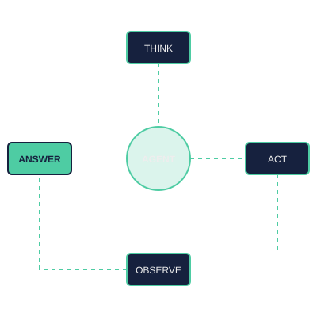

<div align="center">
  

  # 🤖 Awesome AI Agent Loops & Architecture Patterns 🔄

  [](https://github.com/ishandutta2007/Awesome-AI-Agent-Loops-Architectures/blob/main/LICENSE)
  [](http://makeapullrequest.com)
  [](https://github.com/ishandutta2007/Awesome-AI-Agent-Loops-Architectures/stargazers)
  [](https://github.com/ishandutta2007/Awesome-AI-Agent-Loops-Architectures/network)

  **A curated collection of architectural patterns, code samples, and best practices for building autonomous LLM agents using the ReAct loop and beyond.**
</div>

---

## 📖 Overview

An **AI Agent Loop** is an iterative architectural pattern where a Large Language Model (LLM) continuously reasons, executes actions through external tools, observes the outcomes, and repeats the cycle until it fulfills a designated goal. 

Instead of relying on a human to manually provide the next prompt, the system autonomously passes its own tool outputs back into the context window as the next input. This is the foundation of **Agentic Workflows** and **Autonomous AI Orchestration**.

---

## 🔄 The Core Agentic Loop Pattern (ReAct)

The foundational loop is built on the **Reasoning and Acting (ReAct)** pattern, which handles task execution in four distinct, repeating stages:

<div align="center">
  
</div>

1.  **🧠 Think**: The LLM evaluates the user request and determines what data or action it lacks.
2.  **🛠️ Act**: The model generates a specific tool call argument to fetch data or modify an external state.
3.  **👁️ Observe**: The application executes the tool and appends the raw result back into the model's chat history.
4.  **✅ Repeat / Finalize**: The model examines the observation. If the goal is reached, it yields a final response; if not, it triggers another tool.

---

## 💻 Code Implementation Samples

### 1. 🐍 Native Python Implementation (From Scratch)
This minimal, zero-dependency Python snippet shows how to manage chat state, match a tool string dynamically, and pipeline observations directly back into the conversational loop.

```python
import json

# Define an available tool for the loop
def get_weather(location: str) -> str:
    """Mock weather API."""
    if "tokyo" in location.lower():
        return "Rain expected, 85% humidity"
    return "Sunny, 75°F"

def run_agent_loop(user_prompt: str, max_iterations=5):
    # Maintain state history inside the loop
    messages = [
        {"role": "system", "content": "You are an autonomous agent. Use tools when needed. If you have the answer, reply with 'FINAL ANSWER: <text>'."},
        {"role": "user", "content": user_prompt}
    ]
    
    tools_map = {"get_weather": get_weather}

    for iteration in range(max_iterations):
        print(f"\n--- 🔄 Iteration {iteration + 1} ---")
        
        # 1. 🧠 THINK: Mocking the LLM's thought process for execution logic
        if iteration == 0:
            # LLM decides it needs the weather tool
            llm_response = 'THOUGHT: I need the current weather. ACTION: get_weather({"location": "Tokyo"})'
        else:
            # LLM reads observations and decides it can now provide the final answer
            llm_response = 'FINAL ANSWER: It is going to rain in Tokyo, so pack an umbrella.'

        print(f"🤖 Agent Output: {llm_response}")
        messages.append({"role": "assistant", "content": llm_response})

        # Check for termination condition
        if "FINAL ANSWER:" in llm_response:
            print("\n✅ Goal achieved. Exiting loop.")
            break

        # 2. 🛠️ ACT: Extract tool and call arguments
        if "ACTION:" in llm_response:
            # Simple string parsing (in reality, use structured JSON/Tool output fields)
            tool_part = llm_response.split("ACTION: ")
            tool_name = tool_part.split("(")
            tool_args_str = tool_part.split("(")[:-1]
            tool_args = json.loads(tool_args_str)
            
            # 3. 👁️ OBSERVE: Fetch tool result and append back to the environment state
            if tool_name in tools_map:
                observation = tools_map[tool_name](**tool_args)
                print(f"👁️ Observation (Tool Result): {observation}")
                messages.append({"role": "system", "content": f"OBSERVATION: {observation}"})

run_agent_loop("Should I bring an umbrella to Tokyo today?")
```

### 2. 🦜 LangGraph ReAct Agent Loop
When working with standard ecosystems, high-level frameworks like [LangGraph](https://github.com/langchain-ai/langgraph) handle message persistence, exceptions, and graph cycles out of the box.

```python
from langchain_core.tools import tool
from langgraph.prebuilt import create_react_agent
from langchain_openai import ChatOpenAI

@tool
def check_inventory(item_id: str) -> str:
    """Checks stock levels for a specific inventory warehouse item identifier."""
    return f"Item {item_id} has 3 units left in Warehouse A."

# Initialize model
model = ChatOpenAI(model="gpt-4o-mini", temperature=0)
tools = [check_inventory]

# Compile the agent graph. This encapsulates the Think -> Act -> Observe cycle loop natively.
agent_executor = create_react_agent(model, tools)

# Invoke the state machine loop
response = agent_executor.invoke({
    "messages": [("user", "Can we fulfill an order for 2 units of SKU-9920?")]
})

print(response["messages"][-1].content)
```

---

## 🛡️ Loop Controls & Production Concerns

Deploying an autonomous agent loop introduces structural risks like infinite execution paths, token draining, and context pollution. Implementing strict edge-case safety configurations is required:

*   **⏳ Hard Iteration Caps**: Enforce a maximum runtime loop depth (typically `max_iterations=10` or `20`) to catch logic errors before running away.
*   **🚫 Repetition Monitors**: Track identical consecutive tool calls. If an agent requests `get_weather("Tokyo")` three times sequentially without changing its parameters, forcefully terminate the task state.
*   **📉 Graceful Degradation**: If an agent exhausts its step allocation without firing a final response payload, configure a fallback parser to synthesize a partial response from its accumulated memory history.

---

## 📺 Resources & Community

[](https://www.youtube.com/watch?v=WGzof1nK7hc)

### 📈 Star History

<div align="center">
   <a href="https://www.star-history.com/?repos=ishandutta2007%2FAwesome-AI-Agent-Loops-Architectures&type=date&legend=bottom-right">
    <picture>
      <source media="(prefers-color-scheme: dark)" srcset="https://api.star-history.com/chart?repos=ishandutta2007/Awesome-AI-Agent-Loops-Architectures&type=date&theme=dark&legend=bottom-right" />
      <source media="(prefers-color-scheme: light)" srcset="https://api.star-history.com/chart?repos=ishandutta2007/Awesome-AI-Agent-Loops-Architectures&type=date&legend=bottom-right" />
      
    </picture>
   </a>
</div>

---

<div align="center">
  Built with ❤️ for the AI community. Contributions are welcome! 🚀
</div>
